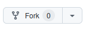
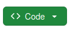

# Bonus Labs for Advanced HTML & CSS

## Before You Begin

Before you start, please click the `Fork` button in the upper right of GitHub.

This will create a "fork" of the original project. Think of it as copy-pasting the original work but the copy belongs to your account instead of the original author's.

Click the green `Code` button and copy the HTTPS code for a later step.

Once you have forked this project, you'll need to clone it down. Go to VS Code, and open a new window with `File > New Window` (you may already be in a new window when you enter VS Code so if that's the case you don't need to start a different one).

Go to `Source Control` in the side bar and choose `Clone Repository`. Paste the HTTPS code and follow any additional instructions from VS Code. It should download and open the folders for you.

## The Practice

1. [HTML](./01-html/) - Build out HTML using an open prompt and semantic elements.

2. [CSS](./02-css/) - Edit the CSS to create a nicer looking page.

3. [ANIMATION](./03-animation/) - Create a GSAP animation guided by what you see in front of you.

## Additional Practice

Check out [Flexbox Froggy](https://flexboxfroggy.com/) for practice with flexbox and [Grid Garden](https://cssgridgarden.com/) for practice with grid.